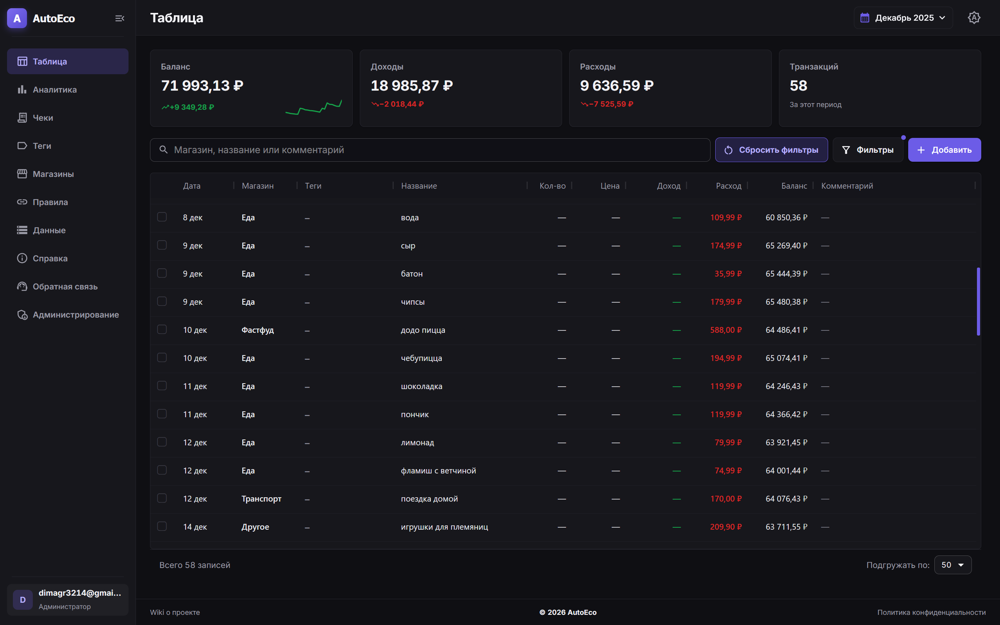
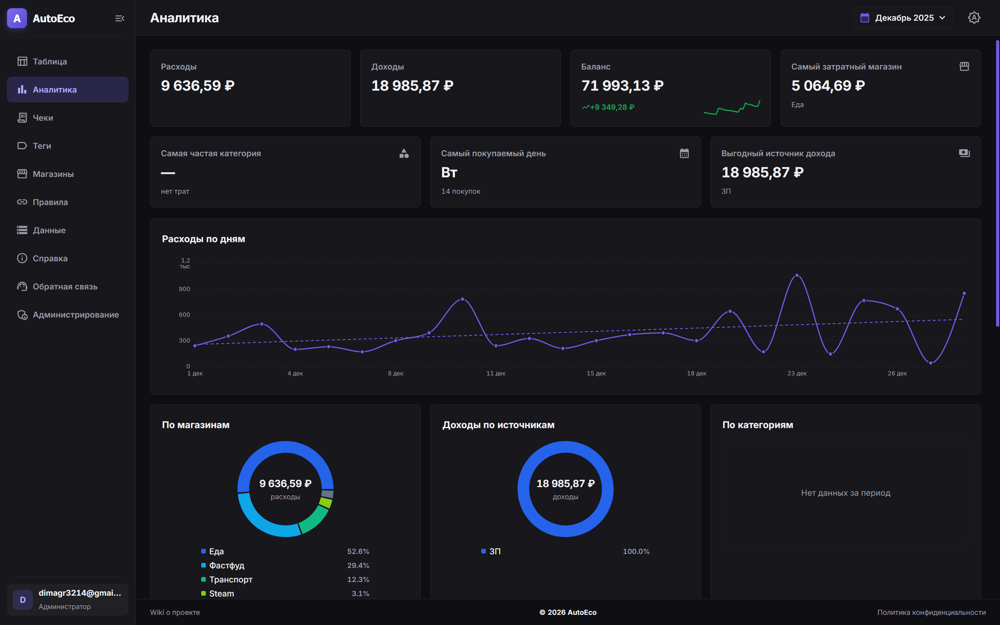
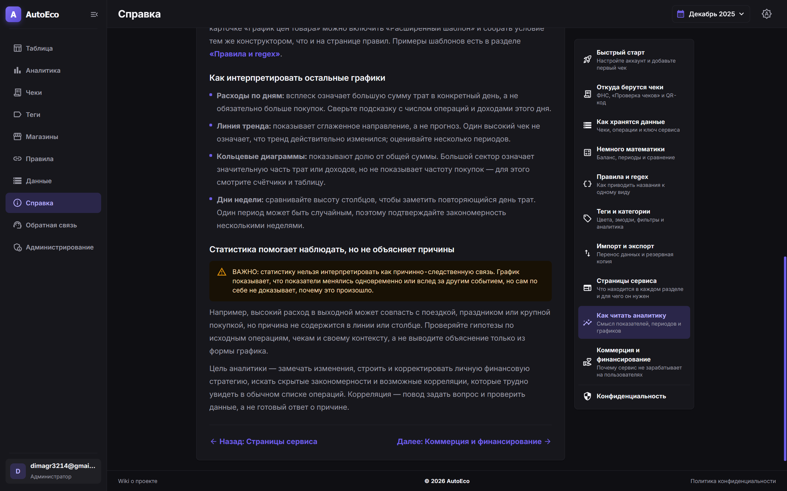
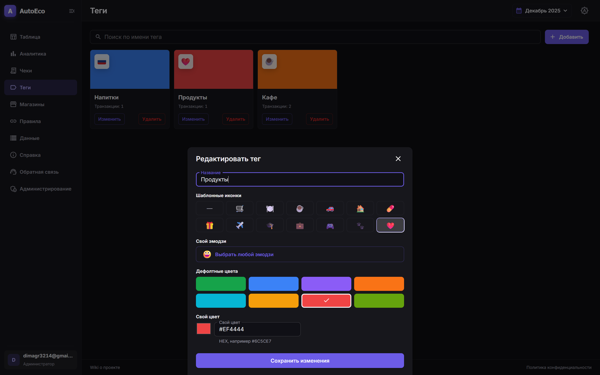
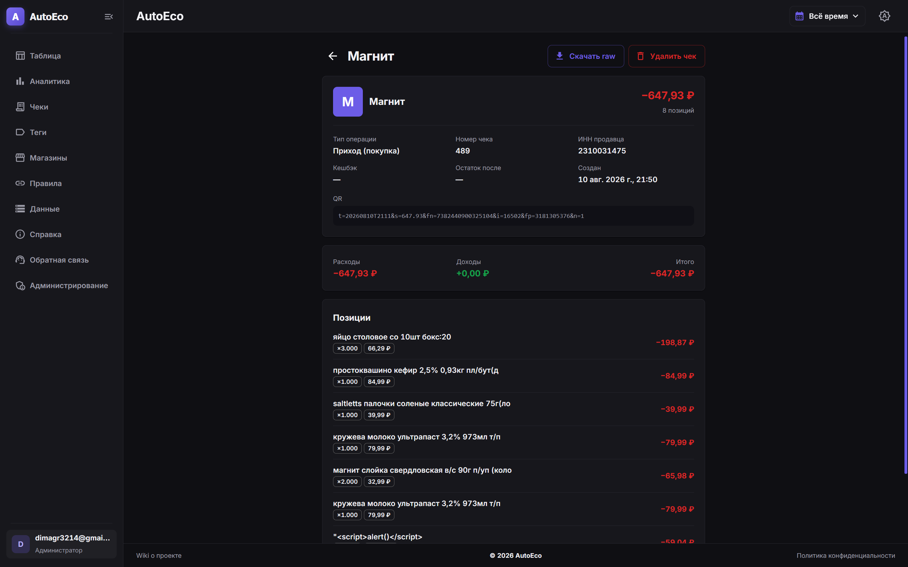
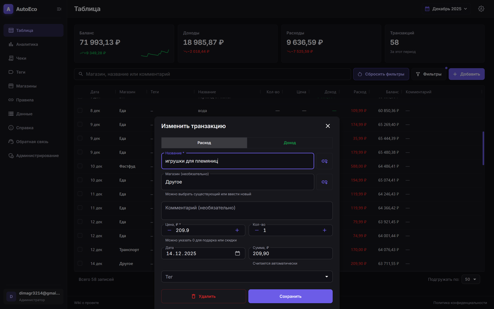
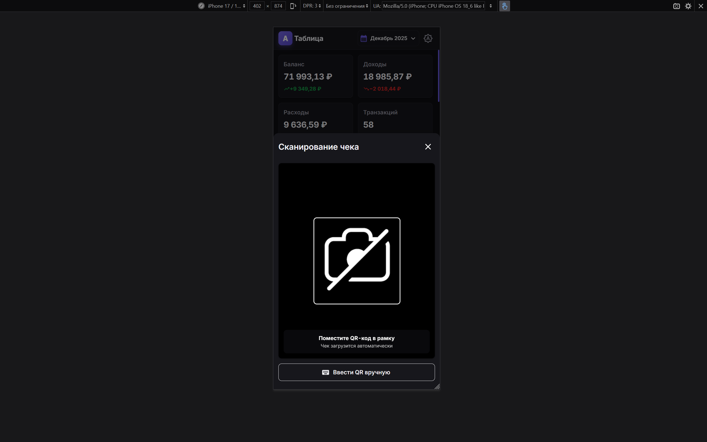
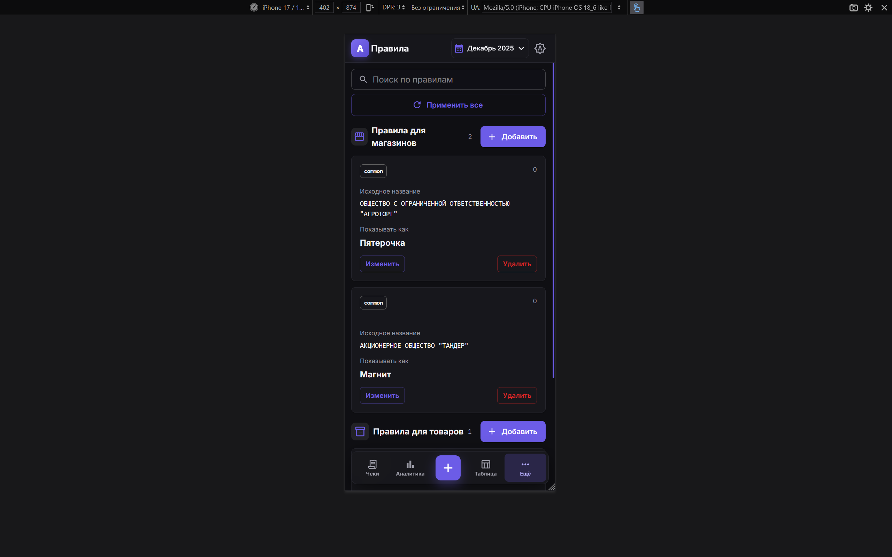
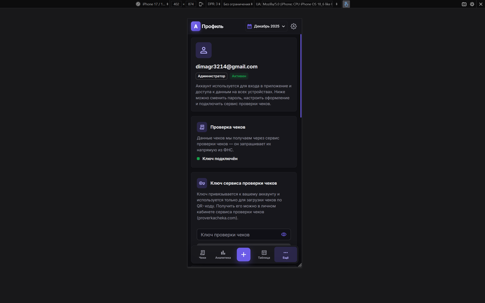

# AutoEco

AutoEco — open-source веб-приложение для учёта чеков, доходов и расходов. Сервис помогает хранить операции, классифицировать их по магазинам и тегам, просматривать аналитику и импортировать или экспортировать финансовые данные.


## Скриншоты

Нажмите на миниатюру, чтобы открыть соответствующий скриншот в полном размере.

| № | Раздел | Устройство | Скриншот |
|---:|---|---|---|
| 1 | Таблица операций | Компьютер | [](docs/scrennshots/screenshot-1.png) |
| 2 | Аналитика | Компьютер | [](docs/scrennshots/screenshot-2.png) |
| 3 | Справка | Компьютер | [](docs/scrennshots/screenshot-3.png) |
| 4 | Теги | Компьютер | [](docs/scrennshots/screenshot-4.png) |
| 5 | Страница чека | Компьютер | [](docs/scrennshots/screenshot-5.png) |
| 6 | Изменение транзакции | Компьютер | [](docs/scrennshots/screenshot-6.png) |
| 7 | Сканирование чека | Телефон | [](docs/scrennshots/screenshot-7.png) |
| 8 | Правила | Телефон | [](docs/scrennshots/screenshot-8.png) |
| 9 | Профиль | Телефон | [](docs/scrennshots/screenshot-9.png) |

## Быстрый старт на Linux

### Требования

- Linux с установленными Docker Engine и Docker Compose Plugin;
- Git;
- доступные порты `80`, `5173`, `5432` и `8080` для dev-режима.

Проверьте установку:

```bash
docker --version
docker compose version
git --version
```

### Скачать проект

```bash
git clone https://github.com/TAskMAster339/AutoEcoWeb.git
cd AutoEcoWeb
```

### Настроить `.env`

Все сервисы используют один файл окружения в корне проекта. Создайте его из шаблона:

```bash
cp .env.example .env
```

Перед запуском обязательно измените как минимум:

- `POSTGRES_PASSWORD` — пароль PostgreSQL;
- `JWT_SECRET` — длинный случайный секрет для подписи токенов;
- `VITE_USE_MOCK_API=false` — использовать настоящий API в production;
- `COOKIE_SECURE=true` — включить для HTTPS;
- `APP_URL` — публичный адрес приложения.

Если нужна отправка кодов подтверждения и восстановления пароля по почте, заполните SMTP-переменные: `SMTP_HOST`, `SMTP_PORT`, `SMTP_USERNAME`, `SMTP_PASSWORD`, `SMTP_FROM` и параметры TLS.

### Собрать и запустить

Для локальной разработки с hot reload:

```bash
docker compose -f docker-compose.dev.yml up -d --build
```

или:

```bash
make dev-up
```

После запуска:

- приложение: <http://localhost:5173>;
- API: <http://localhost:80>;
- Swagger: <http://localhost:80/docs>;
- Adminer: <http://localhost:8080>.

Примените миграции базы данных:

```bash
docker compose -f docker-compose.dev.yml exec -T backend alembic upgrade head
```

Для production-сборки:

```bash
docker compose -f docker-compose.deploy.yml up -d --build
```

В production внешний вход выполняется через nginx. Для HTTPS должны существовать сертификаты в `deploy/certbot/conf`, а DNS публичного домена должен указывать на сервер.

### Создать первого пользователя и сделать его администратором

1. Откройте <http://localhost:5173/login> или публичный адрес приложения.
2. Создайте пользователя через форму регистрации.
3. Подтвердите email шестизначным кодом из письма.
4. Если SMTP не настроен, найдите код в логах backend:

   ```bash
   docker compose -f docker-compose.dev.yml logs -f backend
   ```

5. После подтверждения email обновите статус и роль скриптами. Замените `your-email@example.com` на email первого пользователя:

   ```bash
   chmod +x scripts/set-user-status.sh scripts/set-user-role.sh
   ./scripts/set-user-status.sh your-email@example.com active
   ./scripts/set-user-role.sh your-email@example.com admin
   ```

Скрипты проверяют допустимые значения и обновляют пользователя через PostgreSQL внутри контейнера. Допустимые статусы: `pending`, `verified`, `active`, `blocked`. Допустимые роли: `user`, `admin`.

Статус нового пользователя проходит путь `pending → verified`; вход разрешён только после перевода в `active`. Роль `admin` открывает административный раздел.

Остановить dev-окружение можно командой:

```bash
docker compose -f docker-compose.dev.yml down
```

### Вики и справка

В приложении есть встроенная вики-справка. Она доступна по маршрутам:

- `/about` — главная страница справки;
- `/about/<тема>` — отдельная статья справки;
- `/privacy` — политика конфиденциальности.

В исходном коде страницы справки находятся в `frontend/src/pages/AboutPage.tsx`, а политика конфиденциальности — в `frontend/src/pages/PrivacyPolicyPage.tsx`.

## Создание проекта и некоммерческий статус

AutoEco создан как независимый open-source проект для личного учёта финансов и демонстрации разработки веб-приложений. Проект не является коммерческим продуктом, не предоставляет финансовых, бухгалтерских или инвестиционных консультаций и не гарантирует сохранность данных без самостоятельного резервного копирования.

Используйте приложение на свой риск и проверяйте корректность импортированных и рассчитанных данных.

## Лицензия

Проект распространяется как open-source программное обеспечение под лицензией MIT. Полный текст лицензии находится в файле [LICENSE](LICENSE).

Вы можете использовать, изменять и распространять проект в соответствии с условиями MIT License.
